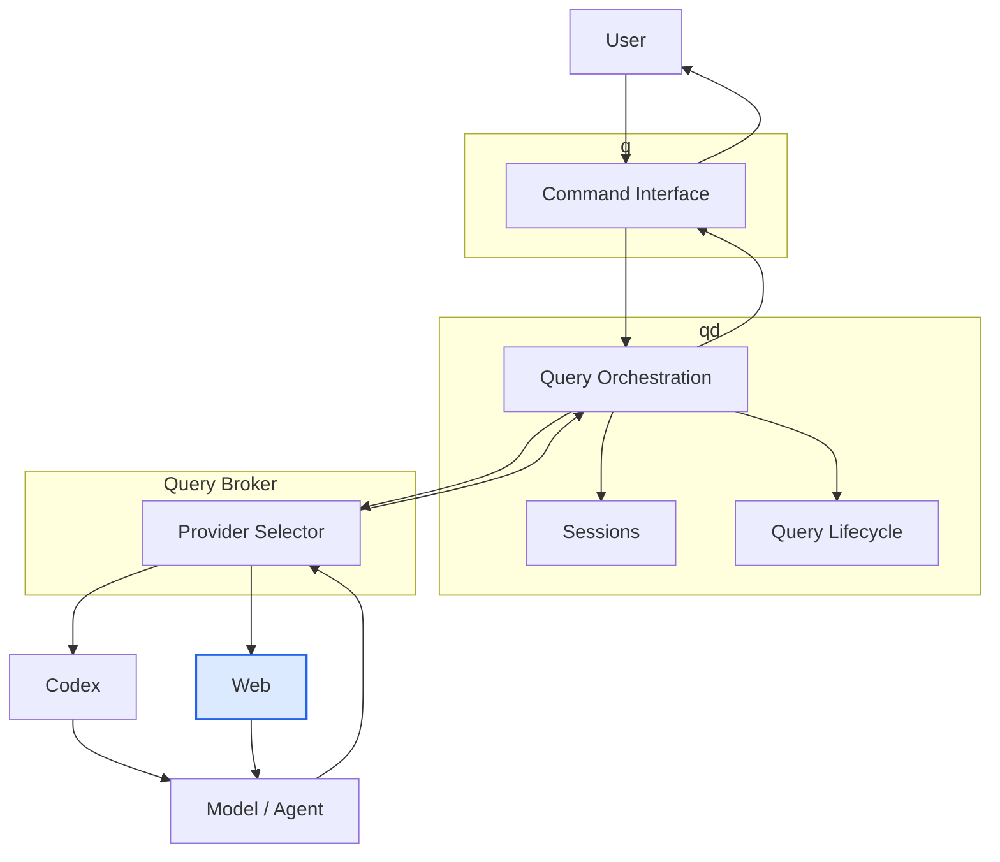

# chatgpt-web-provider

`chatgpt-web-provider` exposes an OpenAI-compatible HTTP API backed by a browser-controlled ChatGPT session.

It allows local tools and services to submit requests through a conventional API while the provider handles interaction with ChatGPT through a dedicated browser worker.

## Architecture



Within the wider q/qd architecture, `chatgpt-web-provider` supplies the Web provider path. It presents a normal HTTP API to callers while managing the browser-backed ChatGPT session behind that interface.

## Installation

Create a virtual environment and install the project:

```sh
python3 -m venv .venv
. .venv/bin/activate
pip install -e '.[test]'
```

Create the environment configuration:

```sh
cp .env.example .env
```

For a local mock-backed installation:

```sh
CHATGPT_WEB_API_KEYS=dev-token \
CHATGPT_WEB_BACKEND=mock \
chatgpt-web-provider
```

For browser-backed operation, configure a dedicated ChatGPT browser profile before starting the provider.

See [docs/installation.md](docs/installation.md) and [docs/browser-backend.md](docs/browser-backend.md) for detailed setup.

## Usage

Default local API endpoint:

```text
http://127.0.0.1:8791
```

Check provider health:

```sh
curl -s http://127.0.0.1:8791/health
```

List available models:

```sh
curl -s \
  -H "Authorization: Bearer $CHATGPT_WEB_API_KEY" \
  http://127.0.0.1:8791/v1/models
```

Submit a Chat Completions request:

```sh
curl -s \
  -H "Authorization: Bearer $CHATGPT_WEB_API_KEY" \
  -H 'Content-Type: application/json' \
  http://127.0.0.1:8791/v1/chat/completions \
  -d '{
    "model": "chatgpt-5.6-sol-web",
    "messages": [
      {"role": "user", "content": "Say exactly: pong"}
    ]
  }'
```

Submit a Responses-style request:

```sh
curl -s \
  -H "Authorization: Bearer $CHATGPT_WEB_API_KEY" \
  -H 'Content-Type: application/json' \
  http://127.0.0.1:8791/v1/responses \
  -d '{
    "model": "chatgpt-5.6-sol-web",
    "input": "Say exactly: pong"
  }'
```

Inspect provider status:

```sh
curl -s \
  -H "Authorization: Bearer $CHATGPT_WEB_API_KEY" \
  http://127.0.0.1:8791/v1/provider/status
```

Further documentation:

- [Features](docs/features.md)
- [API](docs/api.md)
- [Authentication](docs/authentication.md)
- [Installation](docs/installation.md)
- [Browser backend](docs/browser-backend.md)
- [Configuration](docs/configuration.md)
- [Provider runtime](docs/provider-runtime.md)
- [Deployment](docs/deployment.md)
- [Postman](docs/postman.md)
- [Security](docs/security.md)
- [Troubleshooting](docs/troubleshooting.md)
- [Limitations](docs/limitations.md)
- [License](docs/license.md)
